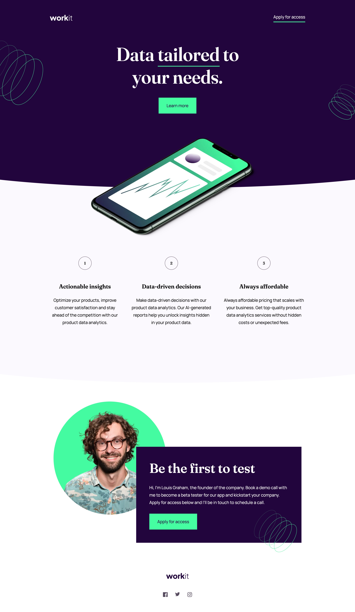
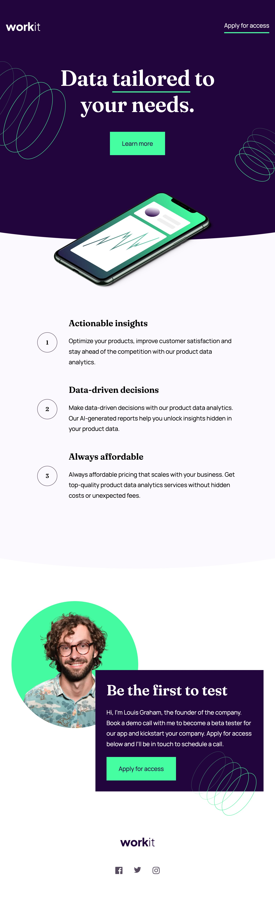
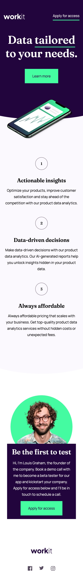

# Frontend Mentor - Workit landing page solution

This is my solution to the [Workit landing page challenge on Frontend Mentor](https://www.frontendmentor.io/challenges/workit-landing-page-2fYnyle5lu).

## Table of contents

- [Overview](#overview)
  - [The challenge](#the-challenge)
  - [Desktop screenshot](#desktop-screenshot)
  - [Tablet screenshot](#tablet-screenshot)
  - [Mobile screenshot](#mobile-screenshot)
  - [Links](#links)
- [My process](#my-process)
  - [Built with](#built-with)
  - [What I learned](#what-i-learned)
  - [Continued development](#continued-development)
  - [Useful resources](#useful-resources)
- [Author](#author)

## Overview

### The challenge

Users of this solution should be able to:

- View the optimal layout for the interface depending on their device's screen size
- See hover and focus states for all interactive elements on the page

### Desktop screenshot

### Tablet screenshot

### Mobile screenshot

## My process

### Built with

- Semantic HTML5 markup
- CSS custom properties
- Flexbox
- CSS Grid

### What I learned

My primary take away is that my HTML & CSS chops are actually more advanced than I previously gave myself credit for. I was able to look at the design file, make a mental map of how I would approach it, and execute what I envisioned (tweaking along the way, of course).

This was my first time using CSS Grid. I was aware of the layout system in the abstract, but had never had the opportunity to apply it in a project. It is nice to have another tool in the toolbox. Using CSS Grid to solve for the founder section was definitely a challenge at first, but turning on the grid inspection tool in Chrome really helped me visually understand what I was doing.

I was also able to further refine my problem solving skill-set. The curved background styling must have gone through at least 4 iterations before I found something that worked without relying (too much) on the good old "magic numbers".

Using GitHub version control also allowed me to stop and think about what I have done and document it more thoroughly.

### Continued development

This project took me more time to complete than I would have liked - probably 6 hours in total. In my previous experience as a WordPress/Divi developer I was used to only really using page builders, which I now know created some poor work habits. I will be able to get the development time down purely by practicing vanilla HTML & CSS more.

As this was my first time properly utilizing version control via GitHub, I'm sure my commit history and messages are a bit messy. Again, more practice will solve this.

Positioning is another area that I would like to further develop and refine.

### Useful resources

- [Kevin Powell](https://www.youtube.com/watch?v=HFG3BKOqOlE) - This helped me learn the basics of CSS Grid, as well as how to overlap content.

## Author

- Frontend Mentor - [@alexbachell](https://www.frontendmentor.io/profile/alexbachell)
